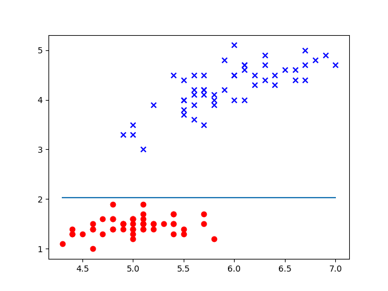

# Decision Stumps

Decision stumps are a single part of a larger classifier called a decision tree
(wow, big surprise there Sherlock) in the same way a perceptron is the building
block of a neural network.

The key thing to know is that a stump only breaks apart a dataset in a single
dimension -- it operates on thresholds, stepping forward through the range of
values in a dimension based on a distribution, recording the error when
splitting the data across that threshold. It can repeat this process for each
dimension of the training set, finding the one with the lowest error and using
that threshold to make a hard and fast rule for prediction, like so:

When applied as a single weak learner and then chained into another kind of
classifier, such as a [perceptron](Perceptron.md) or [SVM](SoftSVM.md), it can
effectively boost the power of the chained learner while reducing the cost
compared to only using the chained learner. When applied in series, the
resulting decision tree can have high accuracy and low risk, but is prone to
overfitting when applying too many branches.
