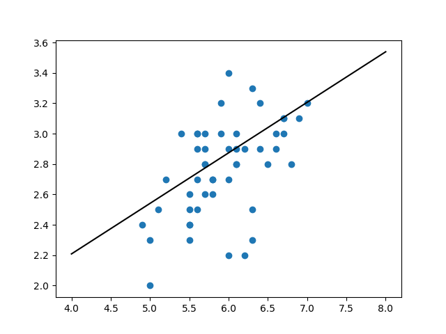

# Linear Regression

The linear regression model here is a gradient descent, though calling it
*stochastic* would be disingenuous since there is no randomness here. It has
also been simplified as much as possible for the sake of understandability.

Here is what the figure in [the example](../src/linear_regression_example.py)
looks like when you run it.



## Usage

Usage in your own applications is pretty easy since this is actually just a
single function, and it even has a fat docstring for you to put on your bedside
table:

```py
from ML.LinearRegression import linear_regression
```

Once you have it imported, you should decide whether or not you want logging.
Since this stepping is an iterative process (as will be explained later), you
may want to be able to see how the process went so that you can better *tweak
your knobs*.

The *knobs* the user has available are the number of iterations and the learning
rate, in addition to the logging:

```py
X, y = load_data_iris(0, 1, 'versicolor')
log_var = []
# Optional arguments also include n_iter for iterations (def 500)
# and learning_rate, a float that determines how much the weights
# are affected (def 0.01)
weights, bias = linear_regression(X, y, logging=True, log=log_var)
```

It should be noted that `X` and `y` here need to be `numpy.ndarray` for things
to go smoothly, so make sure that is the case. The
[**example**](LinearRegression.py) has a good example of some of this data
wrangling, most notably in the last few lines of `load_data_iris`.

## Theory

Hooray, some math I understand! Gradient descent itself is pretty easy in
theory; we have a function that can be imagined as a big bowl in general shape,
though that may not be completely accurate depending on the function. The most
important part is that it has a local minimum (the bottom of the bowl), and we
want to get to that local minimum by following the downward edges of the bowl
that lead to that local minimum.

Now, in the case of linear regression, we are effectively trying to find the
value of each $w_i$ in following function:

$$ \hat{y} = w_0 x_0 + w_1 x_1 + \cdots + w_n x_n + b $$

In this context, $n$ is the number of features that affect the output
variable and the $b$ is much like a $y$ intercept in the tried and true
$y = mx + b$.

For further cases, we'll call this function $\hat{y}$ or a predictor.

The only way we can know if we are making our predictor more accurate is to
compare it to the data that we have, or our actual $y$ values. The difference
between the predictions made by $\hat{y}$ and the actual result values $y$ is
our *error*. This error is what we want to minimize by means of gradient
descent.

But if we want to descend the gradient, we have to have a function that is our
metaphorical bowl. We just know we want to minimize the error. The easiest way
to do this is to make a function out of our predictor's errors, which we will
call a loss function. I'm going to skip the droll here and give you the meat:

$$ L = (\hat{y}_i - y)^2 $$

Just remember that $\hat{y}$ is the predictor function we had before and that
$y$ is an actual result value. I'm glossing over a fair bit pertaining to
applying this to all the data points we were given, so be thankful.

So now we have a function we want to minimize, but how do we descend its'
gradient (or slope)? We take partial differentials of it with respect to each
variable we are trying to tweak -- in this case, the weights $w_i$ and the bias
$b$. The partial differentiation is not terribly hard, but requires some chain
rule to get to our destination. The bias ends up just being 1, while the
weights' all end up being $2 \cdot error \cdot w_i$. Since we want to go down,
we just subtract this differential instead of add it; the opposite of the
greatest increase in a function is the greatest decrease.

So, we have our partial differentials which let us figure out which direction to
tweak the weights in our predictor. As we get closer to an optimal solution, the
rate of descent decreases (usually), and we eventually get pretty darn close to
an optimal set of weights and a corresponding bias.

Since this process is iterative, we just start with some array of weights --
where they start shouldn't really matter so long as one gives the gradient
descent long enough to reach the local minimum -- and we adjust them based on
the partial differentials and the computed error. Since this error is naturally
too large on its own and would make the descent end up "zig zagging" off
opposite sides of the bowl, we use a constant of some small amount to reduce how
much the weights are affected.

## Accuracy

Naturally, given we have an iterative process, we can change how many iterations
to perform, which can greatly affect the accuracy. In general though, more
iterations is a good idea, though it comes at the cost of time.

The learning rate, on the other hand, is more fickle -- experiment liberally and
use other resources to determine how well you are doing.

In the case of the example with the iris dataset, the results are reasonably
close (difference of less than 0.01 from Google Sheets' regression).

Plots will be added to the example at a later point.

## Limitations

Since we can theoretically perform this linear regression on a data set with any
number of features, there is obviously a catch -- one should do their best to
ensure that all the features are independent of the others. Not doing so means
that we could very easily be adding error to the regression based on the
fluctuations between the two or more related features.
