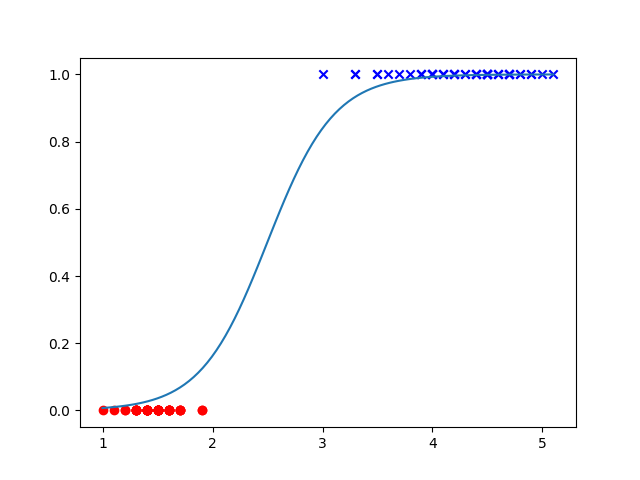

# Logistic Regression

Logistic regression, like [linear regression](LinearRegression.md), uses
gradient descent and a loss function to optimize the coefficients, or weights,
based on the error in the predictions made on each epoch, or iteration. As the
error falls, it becomes closer and closer to the desired function until it is
reasonably close.

## Usage

Logistic regression, unlike linear regression, is used mostly for binary
classification and can serve a similar role as that of a [decision
stump](DecisionStump.md) since it usually leads to a fairly hard and fast
prediction, though this one has a somewhat fuzzy edge in the area between the
two datasets, as we can see in the picture above.

## Theory

As noted above, a logistic regression bears many similarities to a linear
regression, so I recommend reading the theory on that. The only change is that
our loss function (and thus our prediction function) have changed.
