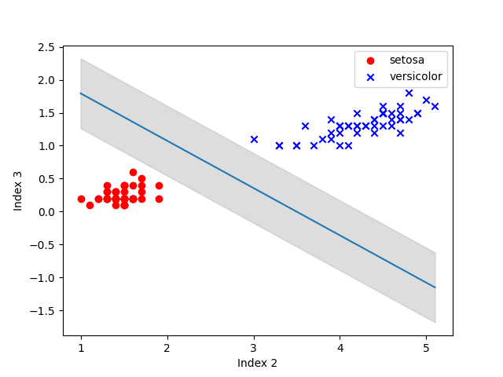

# Soft Support Vector Machine

A support vector machine is a type of binary classifier (like the
[perceptron](Perceptron.md)) that tries to minimize the risk of a
misclassification by means of placing a classifying line (or hyperplane)
as close to center as possible between the linearly-separable data, like shown
below.



You'll notice the shaded area around the fit line, which is the margin. In a
hard SVM, the margin should contain no data points, but a perfectly separable
set can be hard to come by in some cases, so there exists a soft SVM that allows
for misclassifications inside the margin so as to better classify the majority
of possible queries.

## Usage

After importing the class, usage is relatively simple, with sensible defaults
given.

```py
from ML.SoftSVM import SVM

# ...

X = load_data()
svm = SVM()
svm.fit(X)
weights = svm.weights()
```

## Theory

Like most machine learning problems, we seek to minimize or maximize variables
in a specific equation. In this case, we try to optimize the distance between
the separating hyperplane and the points in the separable data.

Now, the equation is pretty ugly, but the optimization is similar to our linear
regression with gradient descent.
# Soft Support Vector Machine

A support vector machine is a type of binary classifier (like the
[perceptron](Perceptron.md)) that tries to minimize the risk of a
misclassification by means of placing a classifying line (or hyperplane)
as close to center as possible between the linearly-separable data, like shown
below.


You'll notice the shaded area around the fit line, which is the margin. In a
hard SVM, the margin should contain no data points, but a perfectly separable
set can be hard to come by in some cases, so there exists a soft SVM that allows
for misclassifications inside the margin so as to better classify the majority
of possible queries.

## Usage

After importing the class, usage is relatively simple, with sensible defaults
given.

```py
from ML.SoftSVM import SVM

# ...

X = load_data()
svm = SVM()
svm.fit(X)
weights = svm.weights()
```

## Theory

Like most machine learning problems, we seek to minimize or maximize variables
in a specific equation. In this case, we try to optimize the distance between
the separating hyperplane and the points in the separable data.

Now, the equation is pretty ugly, but I'll spare you that. The intuitive idea is
that if we have a piece of paper and a small ball, no matter where we hold the
ball above the paper, the shortest distance from the ball to the paper is a line
(or vector) that is normal (or effectively perpendicular) to the paper and
pointing towards/away from the ball.

Given that fact, we can iteratively check each point in each classification of
the dataset and see how far away it is from the separating hyperplane. We then
use gradient descent (which is briefly explained in [Linear
Regression](LinearRegression.md)) to slowly tweak the line until the few closest
samples are the same distance away from the separating line.
